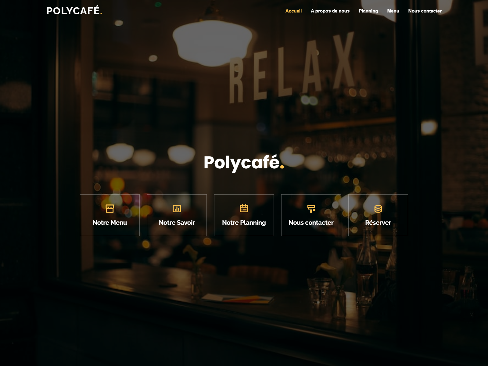
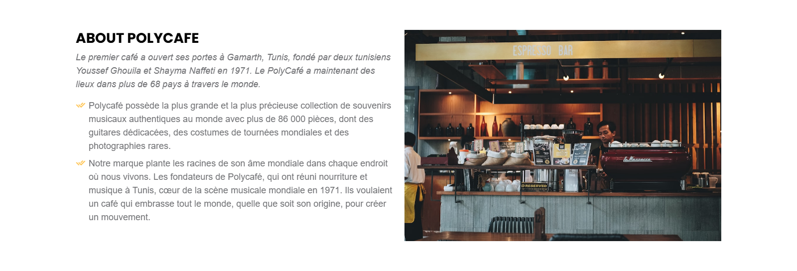
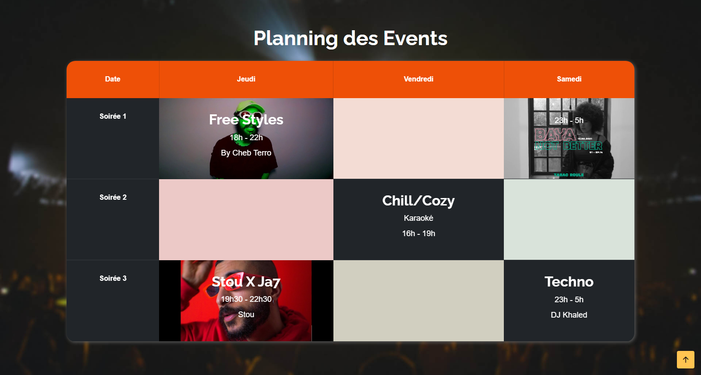
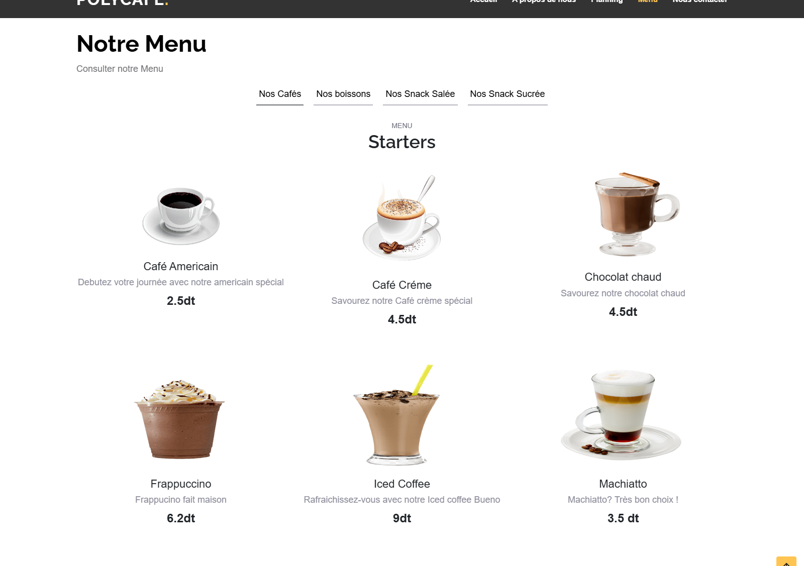
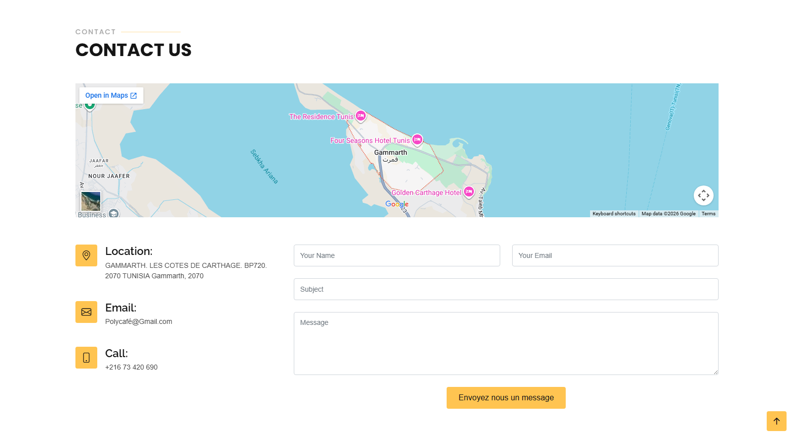

# Polycafe

A modern one-page showcase website for a cafe and restaurant brand. The site presents the brand story, event planning, menu categories, customer testimonials, and contact details in a responsive Bootstrap layout.

[Live Demo](https://youssefjj00.github.io/Polycafe/)  
[GitHub Repository](https://github.com/YoussefJJ00/Polycafe)

## Table of Contents

- Overview
- Features
- Tech Stack
- Project Structure
- Screenshots
- Prerequisites
- Installation
- Running the App
- Contact Form Notes
- Credits
- License

## Overview

Polycafe is a static showcase website built around a single scrolling page. It highlights the cafe identity, a weekly event schedule, a categorized food and drinks menu, customer testimonials, and a contact section with location details and an embedded map.

The page is designed for smooth navigation and animated presentation, with Bootstrap-based responsive sections and vendor libraries for scroll effects, counters, sliders, filtering, and lightbox behavior.

## Features

- Responsive hero section with quick navigation cards
- Brand story and about section
- Event planning table for weekly nightlife and music programming
- Menu system split into coffee, drinks, savory snacks, and sweet snacks
- Animated counters for cafe highlights and social proof
- Testimonials carousel
- Contact section with embedded map, address, phone, and email
- Back-to-top button and sticky navigation behavior
- Mobile navigation toggle
- Smooth scrolling and scrollspy-style active state updates

## Tech Stack

- HTML5
- CSS3
- JavaScript
- PHP for the contact form endpoint
- Bootstrap 5
- AOS for scroll animations
- Swiper for sliders
- Isotope for filtering
- GLightbox for lightbox behavior
- PureCounter for animated counters
- Remix Icon, Bootstrap Icons, and Boxicons for iconography

## Project Structure

```text
.
├── index.html              # Main single-page site
├── README.md               # Project documentation
├── changelog.txt           # Upstream template changelog
├── forms/
│   └── contact.php         # PHP contact form handler
├── assets/
│   ├── css/
│   │   └── style.css       # Main site styles
│   ├── js/
│   │   └── main.js         # Site interactions and animations
│   └── vendor/             # Third-party libraries
├── images/                 # Menu and brand images
├── screenshots/            # Generated project screenshots
└── tools/
    └── capture-screenshots.mjs # Local screenshot generator
```

## Screenshots

These previews were generated from the local Polycafe build and reflect the current site layout.

| Section | Preview |
| --- | --- |
| Hero |  |
| About |  |
| Event Planning |  |
| Menu |  |
| Testimonials |  |
| Contact |  |

## Prerequisites

- A modern web browser
- Optional: PHP 8+ if you want to test the contact form endpoint locally
- Optional: A local web server if you prefer not to open the HTML file directly

## Installation

1. Clone the repository.

```bash
git clone https://github.com/YoussefJJ00/Polycafe.git
cd Polycafe
```

2. Open `index.html` in your browser for a quick preview.

3. If you want to serve it locally instead of opening the file directly, start a local web server from the repository root.

4. If you need the contact form to work, run the project from a PHP-capable local server so `forms/contact.php` can execute.

## Running the App

For a simple static preview, any local server is enough.

```bash
python -m http.server 8000
```

Then open:

```text
http://localhost:8000
```

If you want to exercise the PHP contact endpoint, use a PHP-enabled local server.

```bash
php -S localhost:8000
```

Note that the contact form script expects the PHP Email Form library referenced in `forms/contact.php`.

## Contact Form Notes

The repository includes the form markup and `forms/contact.php`, but the PHP Email Form helper library referenced by that script is not present in this clone.

To make the contact form send mail locally or on a server, you will need to:

- Add the missing PHP Email Form library in the path expected by `forms/contact.php`
- Replace the default recipient address with a real inbox
- Configure SMTP if your hosting setup requires it


## License

No explicit license file is included in this repository. Check the upstream template terms and the project owner's instructions before redistributing the code or assets.
